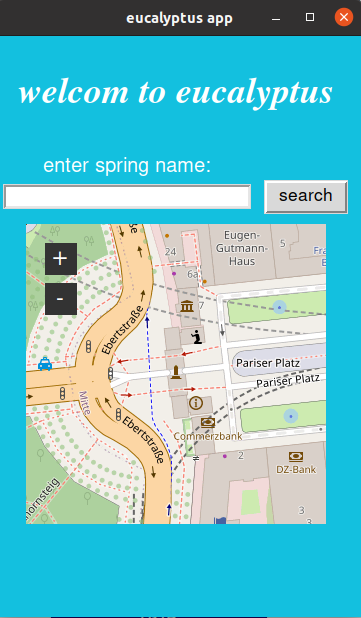
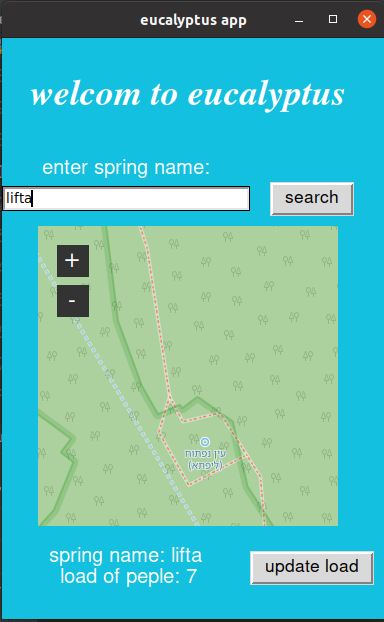
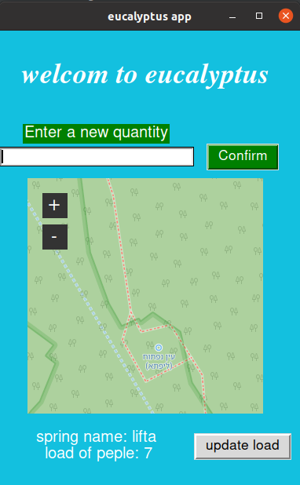

# _Eucaliptus_


<h4> An application for managing loads of travelers in the springs
(Initial and basic version)
</h4>
<br>

### technologies used
* python
* tkinter
* firebase

### How to use the application


One screen app.
You can search for a spring in the search bar and get its location on the map with the amount of people who are there that can be updated in real time

On this screen At this point the user enters a source in the search box and click the search button.
<br>

<br>
The user will receive a location of the spring on the map and the number of people there.
The user has the ability to update the amount of visitors to the spring
<br>

<br>
If the user chooses to update the amount of people, he simply clicks the update button, And the next option will open for him:
All we have to do is enter a new amount of visitors and confirm
<br>

<br>

    
### Running the code
```sh
$ git clone https://github.com/michaelkolet101/Eucaliptus.git
```

```sh 
$ pip install -r requirements.txt
```

```sh
$ py (full path)main_page.py
```


_by Michael Kolet_
 </body>